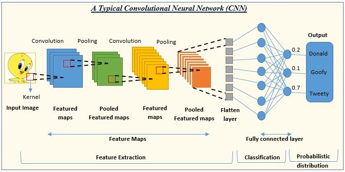
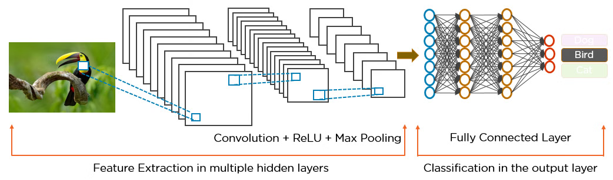
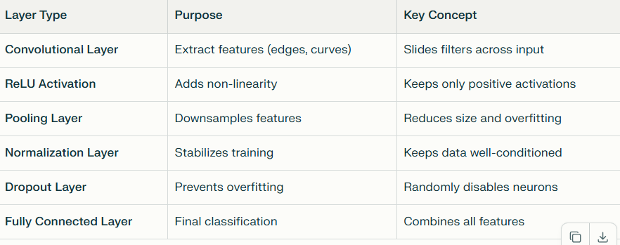

# Understanding Convolutional Neural Networks (CNNs)
Convolutional Neural Networks (CNNs) are a foundational algorithm in deep learning, especially for tasks involving images, videos, and even speech. They’re inspired by the human brain’s visual system and are designed to automatically detect and learn visual patterns such as edges, textures, or complex shapes.

> **In simple terms**: CNNs help computers see and understand images—for example, deciding whether a picture contains a cat, a car, or a tree.

* [What is CNN](#1-what-is-a-convolutional-neural-network)
* [How CNN work](#how-cnns-work-step-by-step)
* [How CNN Learn](#how-cnns-learn)
* [Summary](#summary-of-key-components)
* [Key Summary](#key-takeaway)
  

## 1. What Is a Convolutional Neural Network?
A CNN is a feed-forward neural network primarily used for analyzing images. It processes data that has a grid-like structure—for images, this grid is formed by pixels. The main goal of a CNN is to detect and classify objects within an image while preserving spatial information (the positions of features in the image).

**Common applications include**:
* Object detection in autonomous vehicles
* Face and motion recognition in security systems
* Medical image analysis (like tumor detection)

## How CNNs Work: Step-by-Step

Imagine you have an image say, a handwritten digit or a bird—and you want your model to correctly identify it. Here’s how CNN processes that image:

### Step 1: Input Layer
The image is represented as a matrix of pixel values. For color images, there are three such matrices: one each for Red, Green, and Blue (RGB channels).

### Step 2: Convolutional Layer
This is the heart of CNNs. It detects small patterns like edges or corners.

* A filter (also called a kernel)—a small matrix such as 3×3, 5×5—slides across the image.

* For each position, it computes a dot product between the filter values and the image pixels it overlaps.

* The result is a new image-like representation called a feature map or activation map.
Multiple filters extract different features. For example, one might detect vertical edges, while another detects horizontal edges.

### Step 3: Activation Layer (ReLU)
After convolution, we apply a non-linear function called Rectified Linear Unit (ReLU):
`RELU(x)=max(0,x)`
This helps the network handle complex patterns by keeping only positive signals and introducing non-linearity.

### Step 4: Pooling Layer
Pooling simplifies the feature maps by reducing their size:
Max Pooling selects the maximum value in each small region (like 
2×2 block).

This step makes the network more efficient and robust to small changes (like translations or rotations in the image).

### Step 5: Normalization Layer
Normalization layers (like Batch Normalization) adjust and scale activations so that training becomes more stable and faster. They help prevent overfitting and ensure all features contribute equally.

### Step 7: Fully Connected (Dense) Layer
At the end, the flattened output from the last pooling or convolutional layer is sent into a fully connected layer—much like a regular neural network.

This layer combines all features learned by the earlier layers and outputs a probability distribution over categories (e.g., 90% dog, 10% cat).

### Step 8: Output (Classification)
The final activation (often a softmax function) selects the category with the highest probability.

## How CNNs Learn
During training:
* The network predicts outputs based on random filter weights.
* It compares predictions to the real labels using a loss function (like cross-entropy loss).
* The backpropagation algorithm calculates errors and updates filter weights using gradient descent.

Repeated many times, CNNs learn which features best represent each category.

## Summary of Key Components

## Key Takeaway
CNNs build their understanding layer by layer: from detecting simple patterns like edges to recognizing full objects. By stacking convolution, activation, and pooling layers, they learn hierarchical representations of images automatically—making them powerful tools for modern computer vision.